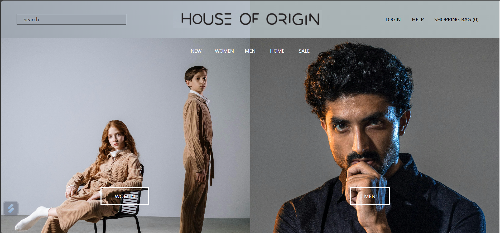

# Chronical Venture Web Development Assignment

Website live :- https://cvassignmentbyadityadwivedi.netlify.app/



This project is a web development assignment given by Chronical Venture. It showcases various aspects of responsive web design and frontend development using HTML, CSS, and Tailwind CSS. The project demonstrates the ability to create a visually appealing and user-friendly interface that adapts seamlessly across different devices.

## Project Overview

The primary objective of this assignment was to create a responsive web page that works well on both desktop and mobile devices. The project includes custom styling and responsiveness achieved through media queries and the Tailwind CSS framework.

## Features

- **Responsive Design:** The layout adjusts smoothly to different screen sizes, providing an optimal viewing experience on desktops, tablets, and mobile devices.
- **Custom Styling:** Utilizes Tailwind CSS for efficient and maintainable styling, along with some custom CSS for specific elements.
- **Dynamic Content:** Interactive elements and dynamic content rendering using HTML and CSS.
- **Cross-Browser Compatibility:** Ensures a consistent look and feel across major web browsers.

## Technologies Used

- **HTML5:** The backbone of the web page, providing the structure and content.
- **CSS3:** Used for styling and layout, including custom styles and media queries for responsiveness.
- **Tailwind CSS:** A utility-first CSS framework that enhances productivity and maintains consistency in styling.

## Installation and Usage

To view the project locally, follow these steps:

1. Clone the repository:
   ```bash
   git clone https://github.com/adityadwivedi2002/chronical-venture-frontend-assignment.git
